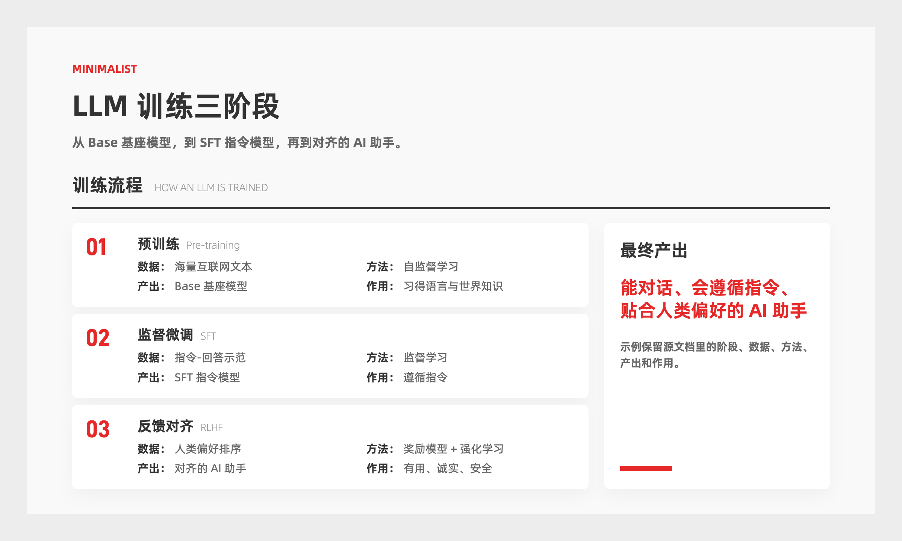
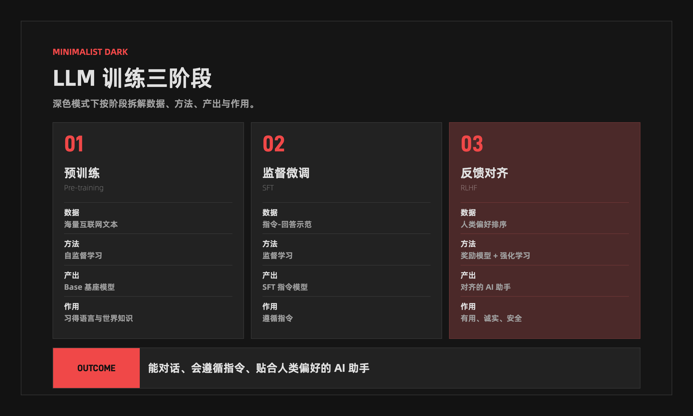
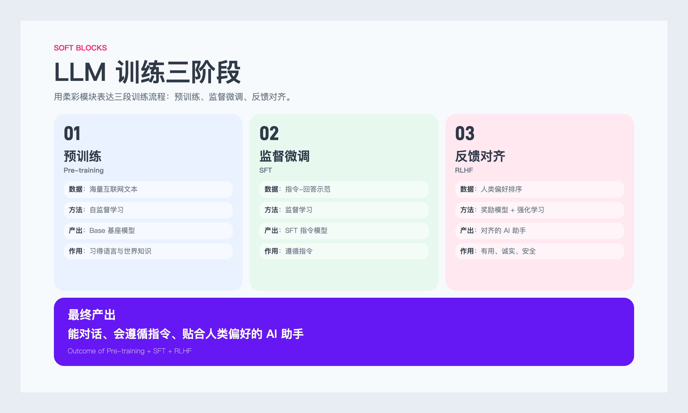

# document-visualizer

`document-visualizer` 是一个面向文档可视化的 Codex Skill。它用于把用户提供的文档、会议纪要、论文、技术方案、PRD、发言转写、结构化数据、结构图或流程图，整理成可信的信息模型，并输出高级、可读、可继续调整的单页 HTML / SVG 图文排版。

它不是通用 PPT、海报或数据分析 skill。核心边界是：必须有源材料，输出以一页长图、文档配图或单页视觉解释为主。

## 适用场景

- 长图、文档配图、单页 HTML/SVG 视觉解释
- 论文讲解、技术方案可视化、会议纪要整理
- 活动信息、产品说明、方案拆解、模块化报告的单页视觉整理
- 数据复盘、账号年度报告、排行榜和时间序列展示
- 结构图、流程图、组织架构图重绘

不适合完整 PPT deck、无源材料的开放式数据分析、泛营销海报、品牌视觉或纯 UI 页面设计。

## 风格

| Preview | Style | Best For |
| --- | --- | --- |
|  | Minimalist（极简风） | 发言总结、培训讲义、会议长文、段落型报告 |
|  | Minimalist Dark（极简深色风） | 深色模式长图、数据报告、技术总结 |
|  | Soft Blocks（柔彩模块风） | 文档总结、方案拆解、活动信息、数据复盘、模块化报告 |

## 使用示例

```text
用 document-visualizer 分析这篇论文，做一张论文讲解长图，先出 HTML。
```

```text
用 document-visualizer 基于这个 Markdown 数据做一个年度复盘长图，使用 soft-blocks 风格。
```

```text
用 document-visualizer 把这个会议纪要整理成清晰的决策、待办和风险长图。
```

## 安装

可以从 GitHub 安装：

```text
https://github.com/brainwung/document-visualizer
```
